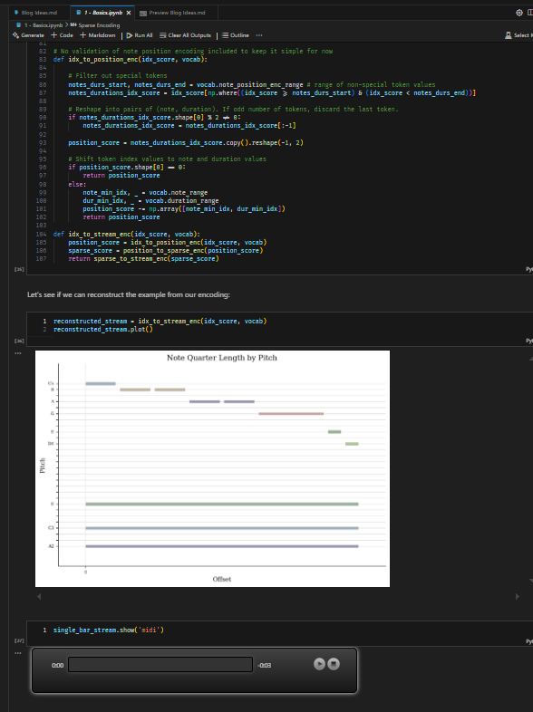
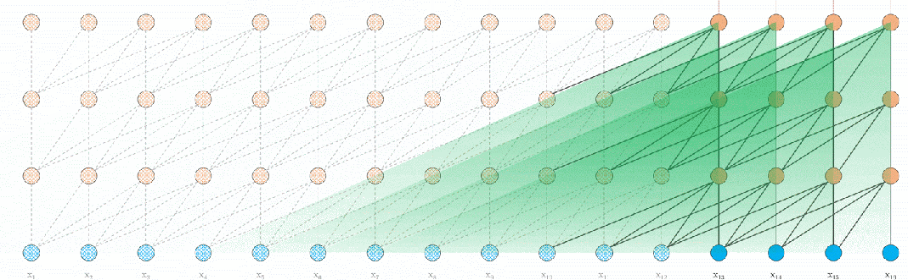
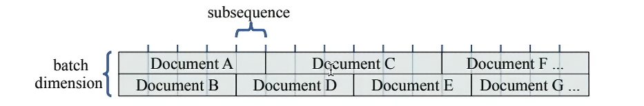

# Intro

In this blog we will explore transformer-based machine learning using music generation rather than the more common text based scenario.

Although we will use the same tools and techniques as text prediction / generation, building a 'Chat GPT for music' adds a few extra challenges which will keep us on our toes and require thinking outside the box (hint - we have multiple notes playing simultaneously and a time dimension to consider!).

We will look at topics such as

- Translation of raw music data into a suitable format for training
- Segmenting the data in a way that allows the model to train effectively
- Transformer 'attention' models which have contextual understanding
- Adding long term memory to transformers

I am going to try to keep it quite high level, but for those interested in taking a look under the covers and digging through code you can [grab the workbooks from my Github](https://github.com/Ryan-Palmer/MIDIGen).

## Motivation / History
In 2013 I wrote my [university dissertation](https://1drv.ms/b/c/91fc7a2609794446/EUZEeQkmevwggJEZBQAAAAABtwH2qjO3hw2U96w6LA3Ytw?e=p5ilV1) on the topic of generative music. This culminated in a [prototype instrument](https://www.youtube.com/watch?v=J-LFz0P3Uto&t=89s&ab_channel=RyanPalmer), coded first in [MaxMSP](https://cycling74.com/) and then [Python](https://www.python.org/), which captured statistics about a performance and then generated more music in the same style.

At the time, machine learning and artificial intelligence were terms more often discussed in academia or even sci-fi rather than business or software circles. Fast forward 11 years and the world looks rather different. We are witnessing an explosion of technology and ideas which are at once exciting for the capabilities they unlock, and also often overwhelming or worrying for the change they bring.

With that in mind I have been racing to catch up and keep up with all of the developments in the ML space which is no mean feat, given the pace of the industry. Having done a lot of cramming with great books such as [Hands on Machine Learning](https://www.oreilly.com/library/view/hands-on-machine-learning/9781098125967/) and excellent video resources such as [Andrej Karpathy](https://www.youtube.com/playlist?list=PLAqhIrjkxbuWI23v9cThsA9GvCAUhRvKZ), [3Blue1Brown](https://www.youtube.com/playlist?list=PLZHQObOWTQDNU6R1_67000Dx_ZCJB-3pi) and [Statquest](https://www.youtube.com/playlist?list=PLblh5JKOoLUICTaGLRoHQDuF_7q2GfuJF)'s channels, I needed a personal project to really embed the knowledge in my mind. What better than to pick up where I left off 11 years ago with music generation, but making use of modern tools and techniques?

I hope to highlight the wonderful people I have learnt from and leave a breadcrumb trail to the resources which helped me along the way. Additionally, I would love to help to de-mystify the topic and show that it really is accessible and understandable to anyone with a curious mind, both technical and non-technical.

In addition to the resources linked above, this project leant heavily on Andrew Shaw's [MusicAutoBot](https://github.com/bearpelican/musicautobot/tree/master) project and Nick Ryan's [Coding a Paper](https://www.youtube.com/playlist?list=PLam9sigHPGwOe8VDoS_6VT4jjlgs9Uepb) series, which themselves were built upon the shoulders of giants. Thanks guys!

# Data

## MIDI format

The [MIDI format](https://en.wikipedia.org/wiki/MIDI) (**M**usical **I**nstrument **D**igital **I**nterface) was developed in the early 1980s as a universal data and hardware standard which allows devices and software developed by different manufacturers to interoperate.

The data and its associated file format(s) effectively represent a digital music score which can be played back on any instrument(s) that support the standard.

Its longevity and popularity make MIDI an ideal source of data for a machine learning project. Also, unlike audio, the score for a piece of music takes up a relatively tiny space and so much more can be loaded into memory and processed quickly. The data mostly comprises of note on / off events and performance information (e.g pitchbend) along with some metadata describing things such as instrument choice and tempo.

There are lots of great sources of MIDI files if you [look around on the internet](https://github.com/albertmeronyo/awesome-midi-sources). I began with a relatively small set of [video game](https://www.vgmusic.com/) music and eventually worked with the entire [Lakh MIDI Dataset](https://colinraffel.com/projects/lmd/) which comprises around **200,000** songs in almost every style you can imagine.

## Tools to load and visualise

There are some great libraries available for loading and working with MIDI files in Python.

This project mainly uses [Music21](https://www.music21.org/music21docs/about/what.html) which is very mature and fully featured. It allows you to load and save MIDI files, inspecting and changing their contents in its high level 'Stream' format.

It also works well with [MuseScore](https://musescore.org/en) to render a piano-roll timeline or classical notation in the output cells of your [Jupyter Notebook](https://jupyter.org/). 

Another python library I used is [pretty-midi](https://craffel.github.io/pretty-midi/) which has a great API and works well with [FluidSynth](https://www.fluidsynth.org/)'s synthesis engine to render the scores as audio.

I used notebooks throughout this project to interleave code, output and thoughts (via the [VSCode](https://code.visualstudio.com/) [Polyglot Notebooks extension](https://code.visualstudio.com/docs/languages/polyglot)). If you haven't experienced notebook programming, I highly recommend giving it a go. The ability to iterate and document as you go allows you to move quickly and experiment with confidence, which is perfect when in exploratory mode.



Example of using notebooks to visualise and listen to code output

## Encoding / Decoding

MIDI data bytes can't be fed directly into a machine learning model - at least not the kind we will be looking at. It first needs to be broken up into a series of tokens, which are each assigned a number. 

For instance, if we were working with text and assigned letters `A=1`, `B=2`, `C=3`, `D=4` and `E=5`, then the words `ACE CAB` would be represented as `135 312`.

Sounds easy enough - however, as hinted in the intro, this is where using music data rather than text presents its first challenge.

- More than one note may be playing simultaneously
- Notes have a position in time relative to each other

The encoding process was therefore a bit more involved. It comprised of three steps:

### 1. Sparse Score

Convert the MIDI file into a giant array which holds a value for each of the 128 pitches at every step in time (and for every instrument!). The value describes if a note was started, and if so for how many timesteps (so a `0` means 'no note' and a `4` means 'start a note which lasts for 4 steps').

We are referring to it as 'sparse' as it is quite literally nearly empty, i.e. most steps on most instruments are zero.

For example, 8 timesteps on a single instrument might look like:

```
4 0 0 0 0 0 0 0 //... up to final timestep of song
0 0 0 0 0 0 2 0
0 2 0 0 0 0 2 0
//... up to 128 rows
```

This short example takes a total of 24 values to show

- Step 1, Pitch 1 = start of a 4-step note
- Step 2, Pitch 3 = start of a 2-step note
- Step 7, Pitches 2 and 3 = start of a 2-step note.

### 2. Position Score

The sparse score isn't very memory or processing efficient, as it contains very little information given its size.

We could, alternatively, just record when each note starts and for how long. This creates a much more compressed form of score. 

Using `-1` to represent a gap before the next note, the previous 24 token sparse example can be re-written using just 14 tokens as

```
1, 4
-1, 1
3, 2
-1, 5
2, 2
3, 2
-1, 2
```

### 3. Index Score

Now we just need to flatten this dual column of values into a single list of tokens so we can feed it into our model, just like the text example of `CAB ACE` earlier.

There are all sorts of different encoding schemes you could employ, many of which can be seen on the [MIDITok](https://miditok.readthedocs.io/en/latest/tokenizations.html) website (which I only just discovered whilst writing this blog!). What they more or less all have in common, including the one I used which was adapted from MusicAutoBot, are

- Tokens for each note (of the 128 available in MIDI)
- Tokens for each duration (from a single timestep all the way up to whatever limit you set on note length).
- A few 'special' tokens for the start and end of a song, and for a gap of silence.

Our example can now be rewritten as

```
<sos><n1><d4><sep><d1><n3><d2><sep><d5><n2><d2><n3><d2><sep><d2><eos>
```

These tokens are each assigned a number and that's it, our data is encoded and ready to go.

To decode the data we just follow the reverse of this process, turning tokens into positions and positions into a sparse score before finally converting the sparse score into MIDI.

> Python's single threaded execution made this painfully slow once I moved to larger datasets, but I discovered the [multiprocessing](https://docs.python.org/3/library/multiprocessing.html) module which allowed me to encode in parallel, massively speeding things up.

# Model

Transformers are a particular class of machine learning model first introduced by Google in their landmark [Attention is all you Need](https://en.wikipedia.org/wiki/Attention_Is_All_You_Need) paper in 2017. 

Until this point, generative models such as [Recurrent Neural Networks](https://en.wikipedia.org/wiki/Recurrent_neural_network) had two significant problems which limited their practical use.

1. They were restricted in their ability to work with large contexts. That is to say, they quickly forgot things and lost the thread of meaning in a sequence, which limited their practical use. Additions such as [Long Short-Term Memory](https://en.wikipedia.org/wiki/Long_short-term_memory) (LSTM) helped with this to a degree.

2. They had to process tokens in sequence order which meant they did not parallelise easily, making them slow to train. It also restricted the models to only using *past* tokens to predict the future (although this could be worked around with [Bi-directional RNNS](https://en.wikipedia.org/wiki/Bidirectional_recurrent_neural_networks) for a further performance cost).

Transformers solve these problems by looking at an entire sequence at once, considering the meaning of words and the relationships between them.

Because we are making a 'next token generator' we shall employ a single-sequence flavour of transformer known as 'decoder only'. This is in contrast to 'encoder-only' which are used to extract meaning from / classify tokens in a sequence, and 'encoder-decoder' which are used for translation tasks (e.g. converting one sequence into another).

I'm not going to try to give an in-depth explanation of transformer models here, as there are already great resources such as the Karpathy, 3Blue1Brown and Statquest channels already linked to at the start. In addition to those, I highly recommend checking out Neel Nanda's [Walkthrough of A Mathematical Framework for Transformer Circuits](https://www.youtube.com/watch?v=KV5gbOmHbjU&t=4s&ab_channel=NeelNanda) which gives a fantastic intuition of how information flows through the model.

I will however try to provide a high level description of the model in the context of this project. 

> **Disclaimer!!!** I will be making heavy use of analogy and simplified concepts to get the general ideas across, which are definitely *not* rigorous or accurate descriptions of how the models actually work. In fact whilst the architecture and maths involved is remarkably simple, exactly how they create their output is still being researched, for instance in the [Mechanistic Interpretability](https://www.youtube.com/watch?v=veT2VI4vHyU&ab_channel=FAR%E2%80%A4AI) community. On top of all that I am a newbie to most of this stuff myself so may get a detail wrong.

## Token Embeddings

The [embedding layer](https://huggingface.co/blog/getting-started-with-embeddings) is the first part of a traditional transformer. It is where we convert tokens from their single assigned number (or 'index') into a bigger list of numbers. These act as coordinates in a semantic space, i.e. the location they point to is supposed to represent the general meaning of the token.

You might therefore expect words that have similar meanings to have similar coordinates, and a word's opposite to be on the negative axis of that particular 'semantic plane'.

For example maybe 'woof' and 'bark' might have similar coordinates in the 'animal noise' plane, and 'hot' / 'cold' might be positive and negative on the temperature axis.

This allows each token to carry much more useful, general information as it heads into the network. They can also be worked with mathematically now that they are in some coordinate system (or 'vector space'). A common illustrative example is the coordinates for `King - Man + Woman` equalling `Queen`.

## Positional Embeddings

The traditional text transformer architectures usually create *another* set of embeddings by assigning a fixed position number to each item in the sequence, i.e. `1` for the first token, `2` for the second and so on. We then embed these position numbers in the same way we did for the token indexes. This allows the model to incorporate information about position. It is reasonable to assume that being the first token in a sequence might be significant for example. 

These positional embeddings are simply added to the token embeddings, combining their 'signals' into the data stream.

We will do a similar thing, however because our transformer is *musical* rather than text based we need to change things up a little.

1. Rather than assign a simple static position to each token based on its sequence position, we will replace our fixed positions with [relative positional embeddings](https://www.youtube.com/watch?v=FhL8ksbtiYg&list=PLam9sigHPGwOe8VDoS_6VT4jjlgs9Uepb&index=4&t=1040s&ab_channel=ChrisMcCormickAI). In this system, if the current token being predicted is assigned `0` then the one before it would be `1`, and before that `2` etc. This allows us to know how far away tokens are relative to the current position. The intuition is that closer tokens to the one being predicted are probably more important. Perhaps every other token might be of interest, such as with our note / duration token pairs.

2. Music has a cyclic structure of bars and beats. This is important information to feed to our model if we want it to learn and then generate musical output. To achieve this we take the absolute timestep of every token in the song and divide it by timesteps per beat and per bar to get the time grid values we need. We then embed these bar / beat values as before and add them to the data stream alongside the relative positional embeddings.

## Residual Pathway

The embeddings are directly connected to the output predictions in a kind of superhighway through the network. Every other part of the model branches off from that stream of data, does whatever it does, then adds its output back into the stream. This is considered important as it prevents the original meaning of the tokens getting lost as it flows through the network.

It also allows the branched parts to be considered, both logically and mathematically, as independent modules (again, see the Neel Nanda walkthrough above for an awesome dive into this).


Diagram of a simple transformer model from [A Mathematical Framework for Transformer Circuits](https://transformer-circuits.pub/2021/framework/index.html).

## Attention

One of the the key innovations in transformer models was the addition of [multi head attention](https://towardsdatascience.com/transformers-explained-visually-part-3-multi-head-attention-deep-dive-1c1ff1024853).

These modules are the parts that analyse the relationships between tokens in a sequence. Each head in a multi-head layer might be focussing on a different kinds of information, for example grammatical or semantic relationships. They can work in parallel, greatly speeding up training. Heads in layers further down the residual pathway might use information about relationships calculated and added in by earlier layers to make higher level associations.

> Note the heavy use of 'might' and 'could' etc here - as mentioned earlier, exactly how they perform their calculations isn't clear or necessarily even consistent, but this is a decent starting intuition.

Attention heads work by once again embedding the input values which were branched from the residual stream. In fact they embed them *three more times* to get values referred to as the `keys`, `queries` and `values`.

The `key` embedding indicates what a token *represents* in the relationship being examined, the `query` indicates what it is *interested* in. and the `value` is its *data*. Each token's `query` is compared to every other token's `key` to get their 'attention scores'. Depending upon how close they are, a proportional amount of that tokens `value` is emitted as the output.

Because we are creating a next-token predictor, we mask off the keys of future tokens so that the model can't cheat and look ahead. This is in contrast to encoder transformers which need to consider a whole sequence in order to capture its meaning.

Once this process of information swapping between tokens is complete, the output of all the heads in a layer are concatenated and fed through a traditional fully connected neural net, or [Multi Layer Perceptron](https://en.wikipedia.org/wiki/Multilayer_perceptron). 

This is simply a few layers of weighted multiplication (or 'linear combinations') of the input values fed through some kind of trigger-like [activation function](https://towardsdatascience.com/activation-functions-neural-networks-1cbd9f8d91d6) (or 'non-linearity') to get the output values. It allows the model to in effect do some computation on the combined relationship information produced from the attention heads.

The output from the MLP is then added back in to the residual stream, contributing its calculations to the superhighway of data for use both by later layers and directly in the output predictions.


## Measuring performance

Just as in essence a GPT-2-like model is a 'next word predictor', we are building a 'next note predictor'. We are going to feed in a sequence of tokens and ask the computer to predict what comes next. We therefore need a way to score how well it has done.

### Output

The output of our model will be a value for each token in our vocabulary. We will interpret the value as the 'log counts' (or [logits](https://deepai.org/machine-learning-glossary-and-terms/logit)) - simply the log of the odds of that token occuring.

Since the reverse of the log function is exponentiation (see the article linked above) we exponentiate the logits to get the *actual* counts (odds) for a given token. 

Finally we divide by the sum of all the counts to normalise the value (i.e. the sum of all token probabilities adds to 1 because the probablilty of a token being generated is 100%). 

This set of operations is known as the [softmax](https://en.wikipedia.org/wiki/Softmax_function) function. It has the effect of exaggerating large probabilities and minimising small ones, and it gives us our output predictions from the model.

### Loss

During training, we are asking the model to simultaneously guess the next tokens for each sequence in a batch. The combined loss is simply a measure of how confident the model was in the correct next tokens vs the others.

To calculate how good a set of predictions is, you could multiply the probabilities the model assigned to the correct tokens. However, because each value is between 0 and 1, multiplying them together very quickly results in a tiny number which is hard for a computer to represent and not very nice to work with.

For this reason, it is common to take the [log](https://www.mathsisfun.com/algebra/exponents-logarithms.html) of the probablilities, known as the **log likelyhood**. This has two benefits:

- It has a range from -infinity to zero (i.e. log(0) is -inf and log(1) is zero).

- Where you would multiply probabilities, you *add* their logarithms. This prevents the result from getting tiny.

If we take the *negative* of this value we get a range from zero to +infinity, the **negative log likelyhood**, a measure of how *bad* our predictions were rather than how good.

Dividing this sum by the count of samples to gets us the mean - the **average negative log likelyhood**.

The goal for our model is to minimise this value representing how incorrect we are, effectively saying 'maximise the likelyhood of the predictions being correct' - just what we want!

> I found [this](https://www.naukri.com/code360/library/softmax-and-cross-entropy) article which nicely restates much of the above in more detail with examples, as the Wikipedia articles are a bit intense for the uninitiated! Also check out [this Statquest](https://www.youtube.com/watch?v=6ArSys5qHAU&ab_channel=StatQuestwithJoshStarmer). For a nice explanation of the close relationship between negative log likelyhood and cross entropy loss, [this is a great reference](https://towardsdatascience.com/cross-entropy-negative-log-likelihood-and-all-that-jazz-47a95bd2e81).

## Training

If you aren't familiar with neural networks or the concept of '[back propagation](https://www.youtube.com/watch?v=VMj-3S1tku0&list=PLAqhIrjkxbuWI23v9cThsA9GvCAUhRvKZ&index=1&t=1939s&ab_channel=AndrejKarpathy)' you might be wondering how exactly all the embeddings are created to capture these abstract meanings and how the MLP knows what calculations to do with the head outputs.

The answer is, at least initially, they dont. They are completely random (perhaps initialised within some given bounds).

When the output predictions are generated (with predictably poor results), the output layer looks at how positively or negatively the nodes in the previous layer contributed to its decision. This layer does the same to the one before and so on, all the way back to the input.

You might imagine it like a bunch of cogs [joined together in a chain](https://en.wikipedia.org/wiki/Chain_rule). If you know the number of teeth on each cog, you can work out how much turning the last in the chain will affect the first.

Once you know this you can [nudge each node's weights a little in the appropriate direction](https://www.youtube.com/watch?v=Ilg3gGewQ5U&list=PLZHQObOWTQDNU6R1_67000Dx_ZCJB-3pi&index=3&ab_channel=3Blue1Brown) to improve performance a tiny bit. Repeat this over and over, and eventually providing your data has the information available the model will (hopefully!) gradually tune itself to solve the problem.


## Generation

Once we have trained our network, we hope that given a starting sequence it can reliably predict the next token. 

If we feed that output sequence back in to the model, we get the *next* token and so on. We can repeat this to get any length of sequence. 

Our model input (context) length is capped at the size we chose when we selecting its parameters, so if our generated sequence exceeds this we will need to truncate the oldest tokens.

> A fun subjective test was to take the intro from a song that the model hadn't seen and ask it to continue it. Even with the relatively small video game data set, this showed some promise and would often generate quite musical and suitable passages. One thing that was apparent however was that once tokens had moved outside the context window, they would be forgotten. This prevents incorporation of longer themes and refrains in the music and prevents the model really getting the overall essence of the piece.


# Transformer Memory

In order to help mitigate the capped context length, I incorporated some modifications developed in [Memorizing Transformers](https://arxiv.org/abs/2203.08913) and demonstrated in the [Coding a Paper](https://www.youtube.com/playlist?list=PLam9sigHPGwOe8VDoS_6VT4jjlgs9Uepb) series.

## 1. Short-term (XL) memory

The first is the addition of a kind of short term memory, similar in nature to those used in RNNs but without the need to feed tokens in one at a time.

The implementation is super simple - just save the `key` and `value` embeddings from the previous iteration and allow the model to match the current iteration's `queries` against them, thereby combining information from the previous and current positions. 

We apply this to every layer of the model.

Doing this allows the model to incorporate information from the previous context block, which itself may have incorporated info from the one before and so on. It's a bit like a delay line, allowing information to 'echo' through time and gradually fade out.



## 2. Long-term (k-nearest-neighbours / KNN) memory

The second modification is to actually have a database of *all* previous `key`s and `value`s. This allows the model to find the top `k` most relevant `key`s for its current `queries`, incorporating `value`s from any part of the past sequence. 

We only apply this to a single layer near the output of the model.

> The vector index which allow us to look up the most similar keys is [Faiss](https://faiss.ai/) from Meta. It can be used completely on the GPU which makes it super fast.

# Batches

So, we now know 
- Where we are getting the data from
- How we will encode it
- The architecture of our model

A question yet to be addressed is how we will assemble the data, where we will put it and how we will feed it into the model. It might not be obvious but these are questions which fundamentally determine how fast our model can train and even what kinds of models we can design.

## Grouping songs

We want to feed lots of chunks of lots of songs in to our model at once, so how do we select and arrange these chunks?

### Single sequence

The simplest way is to simply concatenate all of the songs into a super-long sequence and then randomly pick context-sized chunks from it. 

This is easy to implement and means the model should see a wide distribution of samples from the dataset rather than having to work its way through whole songs at a time.

### Sequence per song

The assumption when randomly sampling from the entire dataset as described above is that each iteration is unconnected to the previous. 

This is true in our vanilla transformer, but once we add memory we need the context chunks for a given song to be in order, otherwise our memories won't make sense!

A naive approach would be just to chunk each song into context sized blocks. The problem is that songs can be any length, so if we are doing song-per-batch-dimension then we need to either
- Crop all songs to the length of the shortest in the batch
- Pad all songs to the length of the longest with useless tokens

### Contiguous batches

A better approach, although much more complicated to implement, is keeping each song in a single batch dimension and in order, but appending another song when it finishes. This means the start and stop tokens for each sequence are staggered rather than aligned across batches.



Whenever a sequence in a given batch dimension finishes, we need to clear both the short and long term memory for that batch dimension otherwise the model would be incorporating memories from a completely unrelated sequence.

## Data location

Depending on where we store our data (and Faiss vector index), it will be faster or slower to access. 

Data location is one of the most important factors to consider when making sure a model can train at a reasonable rate. However powerful your computer, its performance is bound by how quickly it can read and write data.

Ignoring on-die cache,

- The fastest place is GPU memory, as this is logically very close to the GPU.

- The next best place is in CPU memory. This is often very fast but it takes time to push it on to the GPU when needed.

- The slowest place is on disk in a memory-mapped file. This is bound to work at the speed of your disk I/O.


# Conclusion

## Learning

The primary goal of this project was to explore the current machine learning landscape in a practical manner. Given I have only covered a fraction of the things I've learnt along the way, I think that went pretty well!

Building something is obviously a much slower process than reading or watching a guide, so it is a learning techique I resort to less often when trying to cram a subject.

It is a much deeper and more involved experience however, which I find activates my brain in a completely different way. Actively asking questions and exploring ideas rather than simply consuming them forces me to really understand what is going on. 

Despite not using Python for over a decade, with a little help from Github Copilot I was able to make rapid progress. [Pytorch](https://pytorch.org/) with [einops](https://github.com/arogozhnikov/einops) in particular was really intuitive and fun to work with and I think anyone with a little programming knowledge would find them easy to pick up.

I have a [repo with the bare dev container](https://github.com/Ryan-Palmer/PyTorch-DevContainer) which you can use to spin up a fully configured Python / Pytorch environment if you would like to take it for a spin.

## Music Generation

Addition of the XL and KNN memory certainly improved the subjective performance of the model, with the ability emerging to remember key phrases from outside the context and refer back to them, keeping an idea going for a reasonable amount of time.

The output clearly showed recognition of the bar and beats of the input, creating continuations that followed the same kind of rhythm.

Quite rudimentry harmonic knowledge did seem to be employed, with chords and scales emerging, but how much of this was luck or subjective projection of structure is hard to say.

I think it is fair to say it didn't approach a consistency that would allow it to pass for a real musician, with frequent detours that didn't really work and the tendency to get caught in strange loops.

That said, it would usually create something passable and often a genuinely suitable and well structured part. Overall, given it was coded ad-hoc by combining and modifying parts of various guides and examples I was glad it worked at all!

## Next Steps

1. The very next thing to do is consolidate and refactor the model, replacing as much of the handwritten code as possible with off-the-shelf solutions which are well tested and optimised. The aim here is to get hands-on and learn rather than get caught up trying to build a framework, and if we want to explore further it is going to be important to have a solid foundation. I will likely use the [MIDITok](https://miditok.readthedocs.io/en/latest/tokenizations.html) tokeniser and transformers from [lucidrain's repo](https://github.com/lucidrains/x-transformers).

2. I will experiment with incorporating other kinds of musical information into the data. For example, the model has 128 tokens for notes, but it doesn't have any explicit way to understand that a low C and a high C are the same note an octave apart. There are many music theory based metrics that could be provided, however which of these might help and which would just clutter the input and would be better off discovered through training isn't clear.

3. This time around I did attempt a form of [byte pair encoding](https://www.youtube.com/watch?v=zduSFxRajkE&list=PLAqhIrjkxbuWI23v9cThsA9GvCAUhRvKZ&index=9&t=104s&ab_channel=AndrejKarpathy) whereby you chunk tokens together, merging their meanings into a new single dedicated token. I was however limited by the way I had encoded bars and beats, which prevented me from merging tokens across timesteps. If I use the MIDITok encoder I think I can avoid the issue. This change, configured correctly and combined with a large and well curated dataset, should in theory trade vocabulary size (and therefore number of output prediction classes) for richer meaning per token and the ability to cram more meaning into a given fixed context window (since one token now represents multiple).

4. Longer term, I would love to examine actual audio analysis rather than simply MIDI. This comes with a whole new bunch of challenges and techniques to learn. Ultimately the two approaches could be combined to analyse audio and generate MIDI or vice versa. I for one would love a robot band to jam with in my bedroom!

I hope this has been an interesting tour through my ML adventure, and if you have any questions or comments please do [get in touch](https://www.linkedin.com/in/ryan-palmer-281262b4/)!