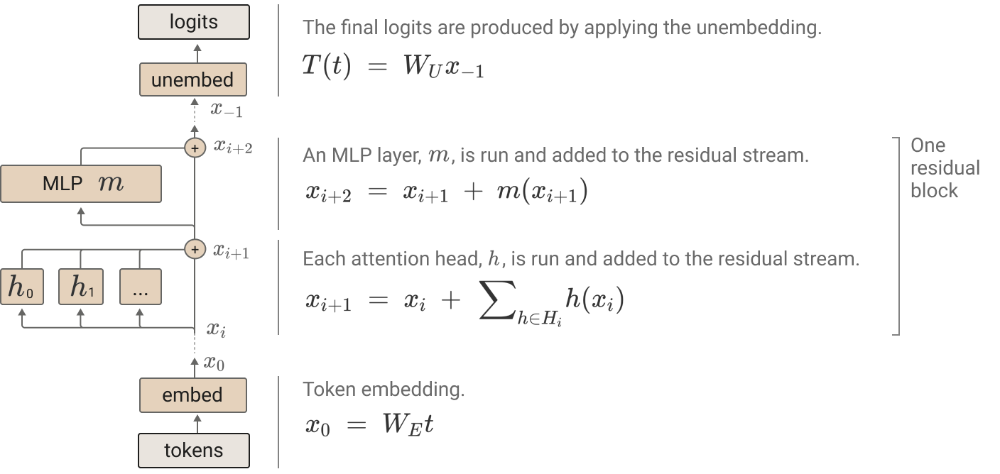

# Intro

In this blog we will explore transformer-based machine learning using music generation rather than the more common text based scenario.

Although we will use the same tools and techniques, building a 'Chat GPT for music' adds a few extra challenges which will keep us on our toes and require thinking outside the box (hint - it has multiple layers and a time dimension!).

We will look at topics such as

- Translation of raw data into a suitable format for training
- Efficient encoding / decoding to allow processing of larger data sets
- Batching, to segment data for the model during training
- Transformer 'attention' models which have contextual understanding
- Adding long term memory to transformers

I am going to try to keep it quite high level, but for those interested in taking a look under the covers and digging through code you can [grab the workbooks from my Github](https://github.com/Ryan-Palmer/MIDIGen).

## Motivation / History
In 2013 I wrote my [university dissertation](https://1drv.ms/b/c/91fc7a2609794446/EUZEeQkmevwggJEZBQAAAAABtwH2qjO3hw2U96w6LA3Ytw?e=p5ilV1) on the topic of generative music. This culminated in a [prototype instrument](https://www.youtube.com/watch?v=J-LFz0P3Uto&t=89s&ab_channel=RyanPalmer), coded first in MaxMSP and then Python, which captured statistics about a performance and then generated more music in the same style.

At the time, machine learning and artificial intelligence were terms more often discussed in academia or even sci-fi rather than business or software circles. Fast forward 10 years and the world looks rather different. We are witnessing an explosion of technology and ideas which are at once exciting and fascinating is the possibilities they unlock, and also often overwhelming or worrying for the change they will bring.

With that in mind I have been racing to catch up and keep up with all of the developments in the ML space which is no mean feat, given the pace of the industry. Having done a lot of cramming with great books such as [Hands on Machine Learning](https://www.oreilly.com/library/view/hands-on-machine-learning/9781098125967/) and excellent video resources such as [Andrej Karpathy](https://www.youtube.com/playlist?list=PLAqhIrjkxbuWI23v9cThsA9GvCAUhRvKZ), [3Blue1Brown](https://www.youtube.com/playlist?list=PLZHQObOWTQDNU6R1_67000Dx_ZCJB-3pi) and [Statquest](https://www.youtube.com/playlist?list=PLblh5JKOoLUICTaGLRoHQDuF_7q2GfuJF)'s channels, I needed a personal project to really embed the knowledge in my mind. What better than picking up where I left off 11 years ago with music generation, but using all of the modern tools and techniques?

I hope to at least highlight all the wonderful people and leave a breadcrumb trail to the resources which helped me along the way. Additionally, I would love to help to de-mystify the topic and show that it really is accessible and understandable to anyone with a curious mind, both technical and non-technical.

In addition to the resources linked above, this project leant heavily on Andrew Shaw's [MusicAutoBot](https://github.com/bearpelican/musicautobot/tree/master) project and Nick Ryan's [Coding a Paper](https://www.youtube.com/playlist?list=PLam9sigHPGwOe8VDoS_6VT4jjlgs9Uepb) series, which themselves were built upon the shoulders of giants. Thanks guys!

# Data

## MIDI format

The [MIDI format](https://en.wikipedia.org/wiki/MIDI) (**M**usical **I**nstrument **D**igital **I**nterface) was developed in the early 1980s as a universal data and hardware standard which allows devices and software developed by different manufacturers to share a common language.

The data and its associated file format(s) effectively represent a digital music score which can be played back on any instrument(s) that support the standard.

Its longevity and popularity make MIDI an ideal source of data for a machine learning project. Also, unlike audio data, the score for a piece of music takes up a relatively tiny space and so much more can be loaded into memory and processed quickly. They mostly comprise of note on / off events and performance information (e.g pitchbend) along with some metadata describing things such as instrument choice and tempo.

There are lots of great sources of MIDI files if you [look around on the internet](https://github.com/albertmeronyo/awesome-midi-sources). I began with a relatively small set of [video game](https://www.vgmusic.com/) music and eventually worked with the entire [Lakh MIDI Dataset](https://colinraffel.com/projects/lmd/) which comprises around 200,000 songs in almost every style you can imagine.

## Tools to load and visualise

There are some great libraries available for loading and working with MIDI files in Python.

This project mainly uses [Music21](https://www.music21.org/music21docs/about/what.html) which is very mature and fully featured. It allows you to load and save MIDI files, inspecting and changing their contents in its high level 'Stream' format.

It also works well with [MuseScore](https://musescore.org/en) to render a piano-roll timeline or classical notation in the output cells of your [Jupyter Notebook](https://jupyter.org/). I used notebooks throughout this project to interleave code, output and thoughts / documentation (albeit via the [VSCode](https://code.visualstudio.com/) [Polyglot Notebooks extension](https://code.visualstudio.com/docs/languages/polyglot))

Another python library I used is [pretty-midi](https://craffel.github.io/pretty-midi/) which has a great API and works well with [FluidSynth](https://www.fluidsynth.org/)'s synthesis engine to render the scores.

## Encoding / Decoding

The MIDI data can't be fed directly into a machine learning model - at least not the kind we will be looking at. It first needs to be broken up into a series of tokens, which are each assigned a number. For instance, if we assigned `A=1`, `B=2`, `C=3`, `D=4` and `E=5`, then the words `CAB ACE` would be represented as `312 135`.

Sounds easy enough - however, as hinted in the intro, this is where using music data rather than text presents its first challenge.

- More than one note may be playing simultaneously
- Notes have a position in time relative to each other

The encoding process was therefore a bit more involved. It comprised of three steps:

1. Sparse Score

Convert the MIDI file into a giant array which held a value for each of the 128 pitches at every step in time (and for every instrument!). The value describes if a note was started, and if so for how many timesteps (so a zero means 'no note' and a 4 means 'start a note which lasts for 4 steps').

It is referred to as 'sparse' as it is quite literally nearly empty, i.e. most steps on most instruments are zero.

For example a single instrument might have

```
4 0 0 0 0 0 0 0 //... up to final timestep of song
0 0 0 0 0 0 2 0
0 2 0 0 0 0 2 0
//... up to 128 rows
```

This short example takes 24 values to show

- Step 1, Pitch 1 = start of a 4-step note
- Step 2, Pitch 3 = start of a 2-step note
- Step 7, Pitch 2 and 3 = start of a 2-step note.

2. Position Score

The sparse score isn't very memory or processing efficient, as it contains very little information given its size.

We could, alternatively, just record when each note starts and for how long. This creates a much more compressed form of score. The previous sparse example can be re-written using 14 tokens as

```
1, 4
-1, 1
3, 2
-1, 5
2, 2
3, 2
-1, 2
```

where `-1` represents a gap before the next note.

3. Index Score

Now we just need to flatten all these values into a single list of tokens so we can feed it into our model, just like the text example of `CAB ACE` earlier.

There are all sorts of different encoding schemes you could employ, many of which can be seen on the [MIDITok](https://miditok.readthedocs.io/en/latest/tokenizations.html) website (which I only just discovered whilst writing this blog!). What they more or less all have in common, including the one I used which was adapted from MusicAutoBot, are

- Tokens for each note (of the 128 available in MIDI)
- Tokens for each duration (from a single timestep all the way up to whatever limit you set on note length).
- A few 'special' tokens for the start and end of a song, and for a gap of silence.

Our example can now be rewritten as

```
<sos><n1><d4><sep><d1><n3><d2><sep><d5><n2><d2><n3><d2><sep><d2><eos>
```

These tokens are each assigned a number and that's it, our data is encoded and ready to go.

To decode the data we just follow the reverse of this process, turning tokens into positions and positions into a sparse score before finally converting the sparse score into MIDI.

# Model

Transformers are a particular class of machine learning model first introduced by Google in their landmark [Attention is all you Need](https://en.wikipedia.org/wiki/Attention_Is_All_You_Need) paper in 2017. 

Until this point, generative models such as [Recurrent Neural Networks](https://en.wikipedia.org/wiki/Recurrent_neural_network) had two significant problems which limited their practical use.

1. They were restricted in their ability to work with large contexts. That is to say, they quickly forgot things and lost the thread of meaning in a sequence, which limited their practical use. Additions such as [Long Short-Term Memory](https://en.wikipedia.org/wiki/Long_short-term_memory) helped with this to a degree.

2. They had to process tokens in sequence order, which meant they did not parallelise easily and made them slow to train. It also restricted the models to only using *past* tokens to predict the future (although this could be worked around with [Bi-directional RNNS](https://en.wikipedia.org/wiki/Bidirectional_recurrent_neural_networks) for a further performance cost).

Transformers solved these problems by looking at an entire sequence at once, considering the meaning of words and the relationships between them.

I'm not going to try to give an in-depth explanation of transformer models here, as there are already great resources such as the Karpathy, 3Blue1Brown and Statquest channels already linked to at the start. In addition to those resources, I highly recommend checking out Neel Nanda's [Walkthrough of A Mathematical Framework for Transformer Circuits](https://www.youtube.com/watch?v=KV5gbOmHbjU&t=4s&ab_channel=NeelNanda) which gives a great intuition of how information flows through the model.

I will just try to provide a high level description of what is going on in the context of this project. 

Because we are making a 'next token generator' we are looking at a particular simple flavour of transformer known as 'decoder only'. (as opposed to 'encoder-decoder', which is used for e.g. translation tasks where you want to convert one sequence into another).

> **Disclaimer!!!** I will be making heavy use of analogy and simplified concepts to get the general ideas across, which are definitely *not* rigorous or accurate descriptions of how the models actually work. In fact whilst the architecture and maths involved is remarkably simple, exactly how they create their output is still being researched, for instance in the [Mechanistic Interpretability](https://www.youtube.com/watch?v=veT2VI4vHyU&ab_channel=FAR%E2%80%A4AI) community.

## Token Embeddings

The [embedding layer](https://huggingface.co/blog/getting-started-with-embeddings) is the first part of a traditional transformer. It is where we convert tokens from their single assigned number (or 'index') into a bigger list of numbers which act as coordinates in a high-dimensional semantic space, representing their more general meaning.

You might expect words that have similar meanings to have similar coordinates, and a word's opposite to be on the negative of it in that particular 'semantic plane'.

For example maybe 'woof' and 'bark' might have similar coordinates in the 'animal noise' plane, and 'hot' / 'cold' might be positive and negative in the temperature plane.

This allows every token to carry much more useful, general information as it heads into the network. They can also be worked with mathematically now that they are in some coordinate system (or 'vector space'). A common example used is `King - Man + Woman = Queen`.

## Positional Embeddings

The traditional text transformer architectures usually create another set of embeddings by assigning a position number to each item in the sequence, i.e 1 for the first token, 2 for the second and so on. This allows the model to incorporate information about position. It is reasonable to assume that being the first token in a sequence might be significant for example. 

These positional embeddings are simply added to the token embeddings, combining their 'signals' into one data stream.

Because our transformer is musical, we need to change things up a little.

Firstly, rather than assign a simple static position to each token based on its sequence position, we use [relative positional embeddings](https://www.youtube.com/watch?v=FhL8ksbtiYg&list=PLam9sigHPGwOe8VDoS_6VT4jjlgs9Uepb&index=4&t=1040s&ab_channel=ChrisMcCormickAI). If the token being predicted is assigned 0, the one before it would be 1, and before that 2 etc, allowing us to know how far the tokens are away relative to the current position. The intuition is that closer tokens to the one being predicted are probably more important.

Secondly, music has a cyclic counting structure of bars and beats. This is important information to feed to our model if we want it to learn and then generate musical output. To achieve this we take the absolute timestep of every token in the song and divide it by timesteps per beat and per bar to get the values we want to embed and add in.

## Residual Pathway

The embeddings are directly connected to the output predictions in a kind of superhighway through the network. Every other part of the model branches off from that stream of data, does whatever it does, then adds its output back into the stream. This is considered important as it prevents the original meaning of the tokens getting 'watered down' and lost as it flows through the network, as was the case with the original RNNs.

It also allows the branched parts to be considered, both logically and mathematically, as independent modules (again, see the Neel Nanda walkthrough above for an awesome dive into this).

## Attention

One of the the key innovations in transformer models was the addition of [multi head attention](https://towardsdatascience.com/transformers-explained-visually-part-3-multi-head-attention-deep-dive-1c1ff1024853).

These modules are the parts that analyse the relationships between tokens in a sequence. Each head in a multi-head layer might be focussing on a different kinds of information, for example various grammatical or semantic relationships. They can work in parallel, greatly speeding up training. Heads in layers further down the residual pathway might use information about relationships calculated and added in by earlier layers to make higher level associations.

> Note the heavy use of 'might' and 'could' etc here - as mentioned earlier, exactly how they perform their calculations isn't clear or necessarily even consistent, but this is a decent starting intuition.

They achieve this by once again embedding the input values branched from the residual stream, in fact three more times, to get values referred to as the `keys`, `queries` and `values`.

The `key` indicates what a token represents in the relationship being examined, the `query` represents what it is interested in. and the `value` is its data. Each token's `query` is compared to every other token's `key` to get their 'attention scores' and depending on how close they are a proportional amount of that tokens `value` is emitted as the output.

Because we are creating a next-token predictor, we mask off the keys of future tokens so that the model can't cheat and look ahead. This is in contrast to an encoder-decode transformer which might want to consider a whole sentence when translating a phrase from one language to another.

Once this process of information swapping is complete, the output of all the heads in a layer are concatenated and fed through a traditional fully connected neural net, or [Multi Layer Perceptron](https://en.wikipedia.org/wiki/Multilayer_perceptron), which is simple a linear combination (i.e. weighted multiplication) of all the input values which is then fed through some kind of non-linear [activation function](https://towardsdatascience.com/activation-functions-neural-networks-1cbd9f8d91d6) to get the output values. It allows the model to in effect do some computation on the combined relationship information produced from the attention heads.

The output from the MLP is then added back in to the residual stream.


#### Diagram of a simple transformer model from [A Mathematical Framework for Transformer Circuits](https://transformer-circuits.pub/2021/framework/index.html).


## Measuring performance

Just like in essence a model like GPT-2 is a 'next word predictor', so we are building a 'next note predictor'. We are going to feed in a sequence of tokens and as the computer to predict what comes next, and we need a way to judge how well it has done.

To calculate how good a set of predictions is, you could multiply the probabilities assigned to the correct characters. However, because each value is between 0 and 1, multiplying them together very quickly results in a tiny number which is hard for a computer to represent and not very nice to work with.

For this reason, it is common to take the [log](https://www.mathsisfun.com/algebra/exponents-logarithms.html) of the probablility, known as the **log likelyhood**. This has two benefits:

- It has a range from -infinity to zero (i.e. log(0) is -inf and log(1) is zero).

- Where you would multiply probabilities, you *add* their logarithms. This prevents the result from getting tiny.

If we take the *negative* of this value we get a range from zero to infinity - the **negative log likelyhood**, a measure of how *bad* our predictions were rather than how good.

Finally, you divide by the count of samples to get the mean - the **average negative log likelyhood**.

If our goal for the model is to minimise this value representing how bad we are, we are effectively saying 'maximise the likelyhood of the predictions being correct' - just what we want!

The output of our model will be a value for each token in our vocabulary. We will interpret the value as the 'log counts' (or [logits](https://deepai.org/machine-learning-glossary-and-terms/logit)) - simply the log of the odds of that token occuring.

Since the reverse of the log function is exponentiation (see the article linked above) we `exp` the logits to get the actual counts for a given token, and then divide that by the sum of all the counts to normalise the value (i.e. now the sum of all probabilities of all tokens will add to 1). This operation is known as the [softmax](https://en.wikipedia.org/wiki/Softmax_function) function. It has the effect of exaggerating large probabilities and minimising small ones.

During training, we are asking the model to guess the next tokens for each sequence in the batch. Of course, we know the answer, so the loss is simply a measure of how confident it was in the correct token vs the others. This is known as [cross entropy](https://en.wikipedia.org/wiki/Cross-entropy#Cross-entropy_loss_function_and_logistic_regression).

> I found [this](https://www.naukri.com/code360/library/softmax-and-cross-entropy) article which nicely restates much of the above in more detail with examples, as the Wikipedia articles are a bit intense for the uninitiated! Also check out [this Statquest](https://www.youtube.com/watch?v=6ArSys5qHAU&ab_channel=StatQuestwithJoshStarmer). For a nice explanation of the close relationship between negative log likelyhood and cross entropy loss, [this is a great reference](https://towardsdatascience.com/cross-entropy-negative-log-likelihood-and-all-that-jazz-47a95bd2e81).


## Training

If you aren't familiar with neural networks or the concept of '[back propagation](https://www.youtube.com/watch?v=VMj-3S1tku0&list=PLAqhIrjkxbuWI23v9cThsA9GvCAUhRvKZ&index=1&t=1939s&ab_channel=AndrejKarpathy)' you might be wondering how exactly all the embeddings are created to capture these abstract meanings, and how the MLP knows what calculations to do with the head outputs.

The answer is, at least initially, they dont. They are completely random (perhaps initialised within some given bounds).

When the output predictions are generated (with predictably poor results), the output layer looks at how positively or negatively the nodes in the previous layer contributed to its decision. This layer does the same to the one before and so on, all the way back to the input.

You might imagine it like a bunch of cogs [joined together in a chain](https://en.wikipedia.org/wiki/Chain_rule). If you know the number of teeth on each cog, you can work out how much turning the last in the chain will affect the first.

Once you know this you can nudge each node a little in the appropriate direction to improve performance a tiny bit. Repeat this over and over, and eventually (providing your data has the information available) the model will hopefully gradually tune itself to solve the problem.


## Generation

Once we have trained our network, we hope that given a starting sequence, it can predict the next token. If we feed that output sequence back in to the model, we get the next token and so on. We can repeat this to get any length sequence, however our model input length will be capped at the number of input tokens we chose when we designed the model so if our sequence exceeds this length we will need to truncate the oldest tokens.

A fun subjective test was to take the intro from a song that the model hadn't seen and ask it to continue it. Even with the relatively small video game data set, this showed some promise and would often generate quite musical and suitable passages. One thing that was apparent however was that once tokens had moved outside the context window, they would be forgotten. This prevents incorporation of longer themes and refrains in the music and prevents the model really getting the overall essence of the piece.


# Transformer Memory

In order to help address this lack of long term context, I incorporated some modifications developed in [Memorizing Transformers](https://arxiv.org/abs/2203.08913) and demonstrated in the [Coding a Paper](https://www.youtube.com/playlist?list=PLam9sigHPGwOe8VDoS_6VT4jjlgs9Uepb) series.

## Short-term (XL) memory

The first is the addition of a kind of short term memory, similar in nature to those used in RNNs but without the need to feed tokens in one at a time.

The implementation is super simple - just save the keys and values from the previous iteration and allow the model to match the current iteration's queries against them in addition to its own. We apply this to every layer of the model.

Doing this allows the model to incorporate information from the previous context block, which itself may have incorporated info from the one before and so on. It's a bit like a delay line, allowing information to 'echo' through time and gradually fade out.

## Long-term (k nearest neighbours / KNN) memory

The second modification if to actually have a database of *all* previous keys and values. This allows the model to look at the `k` most relevant context blocks and match them against its queries, incorporating information from any part of the past sequence. This is only used on a single layer near the output of the model.

The vector index which allows looking up the most similar keys is [Faiss](https://faiss.ai/) from Meta. It can be used completely on the GPU which makes it super fast.

# Batches

## One long seq vs per-song vs contiguous

## Data location (In memory vs on disk and GPU vs CPU)

## Multi-threaded encoding


# Byte Pair / Action Encoding

## Motivation

## Challenges (time dimension)

## Findings


# Training

## Training loop

## Monitoring

## Experimenting


# Conclusion

## Learning

## Music Generation

## Next Steps